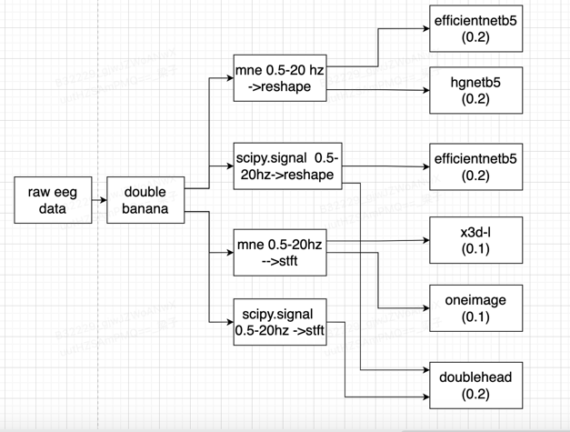

First of all, I would like to thanks to Kaggle and the organizers. I have learned a lot from this experience.  


##  1. model

In early time, feeding a bsx4xHxW input to the 2D-CNN produce worse result than the one-image method.  I start to think why?

Due to the position-sensitive nature of the labels (LPD, GPD, etc.), We should take care of the channel dimension. 2D-CNN is not well-equipped to capture positional information within the channels. Because there is not pad in channel direction. And that's why we need to concat the spectrum into one image for a vision model other than a bsx16xHxW image( double banana montage).
So I decided to use 3d-CNN for spectrum, and 2d-CNN model for raw-eeg signal.


diagram like:


total solution like this:

+ mne 0.5-20hz means use MNE-tool do filter.
+ scipy.signal means use scipy.signal to do filter.
+ For the reshape operator and the stft params please refer to the codes below.
+ And the number in () means final weights of the ensemble.


all model score

| model      | backbone    | filter       | public lb | private lb |
|------------|-------------|--------------|-----------|------------|
| spectrum   | x3d-l       | mne 0.5-20   | 0.253809  | 0.299748   |
| oneimage   | hgnetv2_b5  | mne 0.5-20   | 0.262490  | 0.304877   |
| raw        | effb5       | mne 0.5-20   | 0.230978  | 0.282873   |
| raw        | effb5       | butter0.5-20 | 0.231260  | 0.284402   |
| doublehead | x3d-l effb5 | butter0.5-20 | 0.232257  | 0.285584   |
| raw        | hgnetb5     | mne 0.5-20   | 0.239238  | 0.287301   |
### 1.1 spectrum model


After double banana montage, +-1024 clip and 0.5-20hz filter,
use stft to extract the spectrum, then feed to a 3d-CNN(x3d-l).


The input data is a 16-channels spectrum image.

X3d-l cv 0.21+, public lb0.25 private lb0.29.


I use 2d model too, efficientnetb5, public lb 0.26 private lb0.30.
For 2d model, I concat the 16-channels spectrum image like many people does.


I check the submission score, combine these two model, get 0.28 private lb.

stft code like below, use it as a nn.Module :

```
class Transform50s(nn.Module):
    def __init__(self, ):
        super().__init__()
        self.wave_transform = torchaudio.transforms.Spectrogram(n_fft=512, win_length=128, hop_length=50, power=1)

    def forward(self, x):
        image = self.wave_transform(x)
        image = torch.clip(image, min=0, max=10000) / 1000
        n, c, h, w = image.size()
        image = image[:, :, :int(20 / 100 * h + 10), :]
        return image


class Transform10s(nn.Module):
    def __init__(self, ):
        super().__init__()
        self.wave_transform = torchaudio.transforms.Spectrogram(n_fft=512, win_length=128, hop_length=10, power=1)

    def forward(self, x):
        image = self.wave_transform(x)
        image = torch.clip(image, min=0, max=10000) / 1000
        n, c, h, w = image.size()
        image = image[:, :, :int(20 / 100 * h + 10), :]
        return image


class Model(nn.Module):
    def __init__(self):
        super().__init__()

        model_name = "x3d_l"
        self.net = torch.hub.load('facebookresearch/pytorchvideo',
                                  model_name, pretrained=True)

        self.net.blocks[5].pool.pool = nn.AdaptiveAvgPool3d(1)
        # self.net.blocks[5]=nn.Identity()
        # self.net.avgpool = nn.Identity()
        self.net.blocks[5].dropout = nn.Identity()
        self.net.blocks[5].proj = nn.Identity()
        self.net.blocks[5].activation = nn.Identity()
        self.net.blocks[5].output_pool = nn.Identity()

    def forward(self, x):
        x = self.net(x)
        return x


class Net(nn.Module):
    def __init__(self, num_classes=1):
        super().__init__()

        self.preprocess50s = Transform50s()
        self.preprocess10s = Transform10s()

        self.model = Model()

        self.pool = nn.AdaptiveAvgPool3d(1)
        self.fc = nn.Linear(2048, 6, bias=True)
        self.drop = nn.Dropout(0.5)

    def forward(self, eeg):
        # do preprocess
        bs = eeg.size(0)
        eeg_50s = eeg
        eeg_10s = eeg[:, :, 4000:6000]
        x_50 = self.preprocess50s(eeg_50s)
        x_10 = self.preprocess10s(eeg_10s)
        x = torch.cat([x_10, x_50], dim=1)
        x = torch.unsqueeze(x, dim=1)
        x = torch.cat([x, x, x], dim=1)
        x = self.model(x)
        # x = self.pool(x)
        x = x.view(bs, -1)
        x = self.drop(x)
        x = self.fc(x)
        return x

```


### 1.2 eeg model

View eeg (bsx16x10000) as an image. So expand dim=1( bsx1x16x10000), but the time dimension is too large. Then I make a reshape.
The model define as below
```python
rclass Net(nn.Module):
    def __init__(self,):
        super(Net, self).__init__()
        self.model = timm.create_model('efficientnet_b5', pretrained=True, in_chans=3)
        self.pool = nn.AdaptiveAvgPool2d(1)
        self.fc = nn.Linear(2048, out_features=6, bias=True)
        self.dropout = nn.Dropout(p=0.5)

    def extract_features(self, x):
        feature1 = self.model.forward_features(x)
        return feature1

    def forward(self, x):
        bs = x.size(0)
        reshaped_tensor = x.view(bs, 16, 1000, 10)
        reshaped_and_permuted_tensor = reshaped_tensor.permute(0, 1, 3, 2)
        reshaped_and_permuted_tensor = reshaped_and_permuted_tensor.reshape(bs, 16 * 10, 1000)
        x = torch.unsqueeze(reshaped_and_permuted_tensor, dim=1)

        x = torch.cat([x, x, x], dim=1)
        bs = x.size(0)

        x = self.extract_features(x)
        x = self.pool(x)
        x = x.view(bs, -1)
        x = self.dropout(x)
        x = self.fc(x)
        return x
```
Then, the eeg 'reshaped' to bsx3x160x1000.  With efficinetnetb5, actives public lb 0.230, private lb 0.282.

There are 3 models , but slightly different, mne-filter-efficinetnetb5, scipy.signal-filter-efficientnetb5 and mne-filter-hgnetb5. 
And the scires are slightly different,also.
### 1.3  doublehead (eeg+spectrum)

I use x3d-l to extract the spectrum feature ( with Transform50s only ), efficientnetb5 to extract the raw eeg feature, 
like the solution figure.

concat the last feature. public lb 0.24, private lb 0.29 ? ? not sure

# 2 Preprocess
- 2.1.Double banana montage, eeg as 16x10000
- 2.2.Filter with 0.5-20hz
- 2.3.Clip by +-1024

# 3. Train
- 3.1 Stage1, 15 epochs, with loss weight voters_num/20, Adamw lr=0.001, cos scheduel
- 3.2 Stage2, 5 epoch, loss weight=1, voters_num>=6.   , Adamw lr=0.0001, cos scheduel
- 3.3 use eeg_label_offset_seconds. I random choose an offset for each eegid, and the target is average according to eegid for each train iter.
- 3.4 augmentation, mirror eeg, flip between left brain data and right brain data.
- 3.5 10 folds, then move 1000 samples from val to train, left 709 samples in val set. And use vote_num>=6 to do validation. 

# 4. ensemble

By combining these models, I think it could get my current score. However my score is 6 model emsemble, but not improvement that much (0.28->0.27 private lb). 
Final ensemble including:  
- 2 spectrum model (x3d, efficientnetb5), both use mne-filter
- 3 raw eeg model( efficientnetb5 with-mne.filter, efficientnetb5 -butter filter, 1 hgnetb5 mne.filter),
- 1 eeg-spectrum mix model, butter filter,   

With weights=[0.1,0.1,0.2,0.2,0.2,0.2].

ps. with-mne.filter means use mne lib to do filter, butter filter means use scipy.signal, just to add some diversity.

# Some thought
I think raw eeg is more important in this task.  Feeding raw EEG data into a 2D visual model is somewhat similar to how humans observe EEG signals. Observe in time and channel  dimensions！

